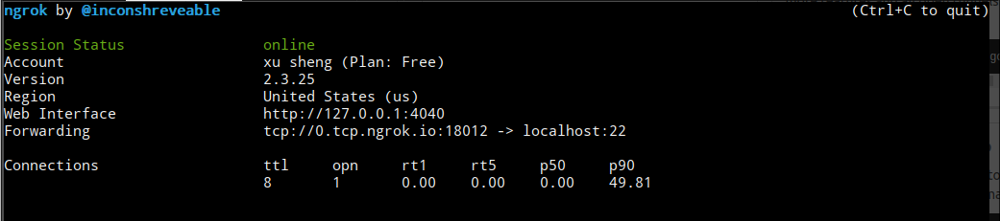
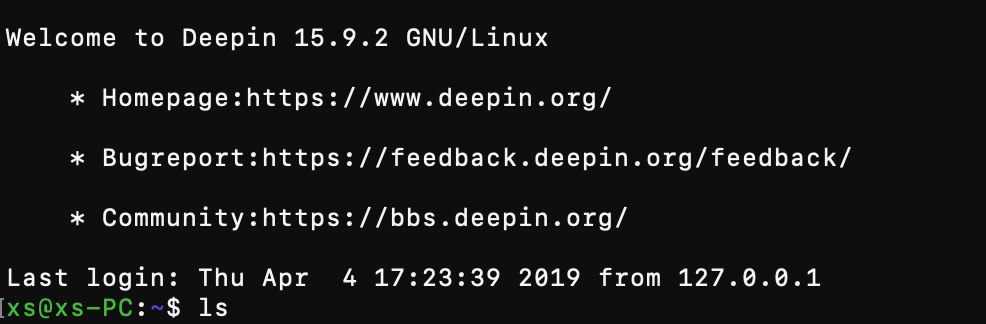

## sshd using ngrok

很久以前在知乎上看到过https://www.zhihu.com/question/27771692这个问题，看到ngrok的解决方案心动了一下，于是决定试试看。事实上并不麻烦，绝大部分时间都是在下载ngrok。

首先在官网https://ngrok.com/下载对应的可执行文件，然后登陆（可以用GitHub账号直接登陆，可以说是很方便了）。之后会分配一个token，直接照着官网的说明
``` bash
$ ./ngrok authtoken AGAwsPS...
```
操作即可。

接下来要在系统上装sshd，我用的是deepin，所以可以很方便地
``` bash
$ sudo apt-get install openssh-server
$ service ssh start
```
完事了。

然后开启ngrok
```bash
./ngrok tcp 22
```
22是ssh的端口。然后你就可以看到这样的界面：



记住forwording这一行的内容。

接下来换到另一台机器，
``` bash
$ ssh 账号@0.tcp.ngrok.io -p 18012
```



ojbk。

